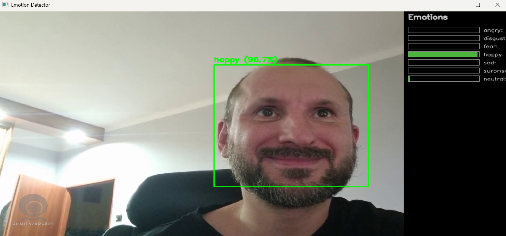
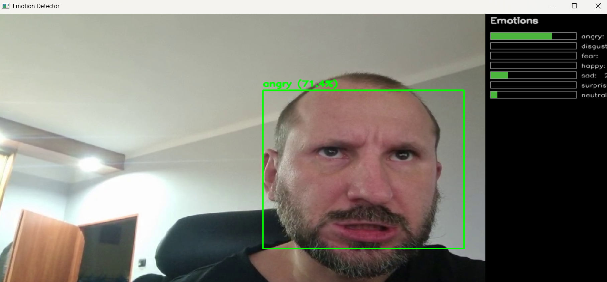

# 😃 Face Emotion Detector — Best Edition

Real-time facial emotion recognition using a webcam feed, combining **DeepFace**, **OpenCV**, and optional **MediaPipe** rotation alignment for improved accuracy.  
The detector predicts 7 basic emotions directly from the live camera stream and visualizes probabilities with dynamic bars.

---

## 🎥 Demo

### ▶️ Live Detection Example


### 🧠 Emotion Samples
| Happy 😊 | Angry 😡 |
|-----------|-----------|
|  |  |

---

## 🚀 Features

- ✅ Real-time emotion detection from webcam  
- ✅ Auto fallback from **MediaPipe** to **HaarCascade** if protobuf breaks  
- ✅ Automatic ROI rotation to align eyes horizontally  
- ✅ Smooth temporal averaging (EMA + history buffer)  
- ✅ Stable detection box (IoU + adaptive switching logic)  
- ✅ Always-on-top window mode  
- ✅ Visualization of all emotion probabilities in a side panel  

---

## 🧩 Supported Emotions
| # | Emotion   | Description |
|:-:|------------|-------------|
| 1 | 😡 **angry**     | anger, frustration |
| 2 | 🤢 **disgust**   | aversion, displeasure |
| 3 | 😨 **fear**      | anxiety, fear |
| 4 | 😄 **happy**     | joy, satisfaction |
| 5 | 😢 **sad**       | sadness, sorrow |
| 6 | 😲 **surprise**  | astonishment |
| 7 | 😐 **neutral**   | calm, relaxed |

---

## 🧠 Model Info

This project uses:
- **DeepFace** backend (`VGG-Face` / `Emotion` model)
- Optional **MediaPipe Face Detection** for bounding boxes and eye rotation
- Fallback to **Haar Cascade** (for stability across TensorFlow / protobuf versions)

---

## ⚙️ Installation

Clone the repository and create a Python environment (recommended via `venv` or `conda`):

```bash
git clone https://github.com/<your_username>/face_emotion_detector_best.git
cd face_emotion_detector_best

pip install -r requirements.txt

